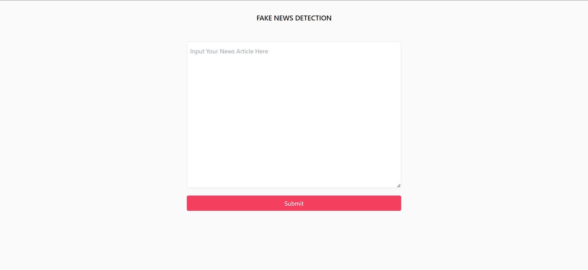
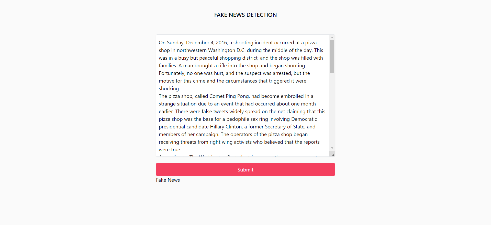

# Fake-News-Detection

An App to classify whether the News is actually Real or Fraud by using its article

> [!NOTE]  
> There is no deployment Since I'm brokie and Vercel only accept file less than 250 mb.


## About Model

- The dataset are grabbed from [Kaggle](https://www.kaggle.com/code/soumikniloy/fake-and-real-news-classifier?rvi=1)
- Importing Libraries :
  ```python
  import pandas as pd
  import matplotlib.pyplot as plt
  from tqdm import tqdm
  import re
  import nltk
  nltk.download('punkt')
  nltk.download('stopwords')
  from nltk.corpus import stopwords
  from nltk.tokenize import word_tokenize
  from nltk.stem.porter import PorterStemmer
  from wordcloud import WordCloud

  ```

- Then loading the Dataset using `pd.read_csv(filename)`. Since there are two different csv (Fake and Real). We should load both
- After load both csv. we can concat them using `pd.concat([real,fake])`
- Dont forget to add classes before Concatting
- Preprocessing
  ```python
  def preProcess(texts):
    tempText=[]
    
    for sentences in tqdm(texts):
        sentence = re.sub(r'[^\w\s]','',sentences)
        tempText.append(' '.join(token.lower() for token in str(sentence).split() if token not in stopwords.words('english')))
        
    return tempText
  ```
- With block of code above, we should be able to preprocess each text on dataset
- for the classifier. This time i use two different classifiers which are Linear Regression and Decision Tree. Both Classifiers resulting good performance
- Saving the model with pickle
  ```python
  import pickle
  def saveModel(model,modelName):
    savePath = f"models/{modelName}.pkl"
    
    pickle.dump(model,open(savePath, "wb"))
    
    return True
  ```

## Routes on Server
- Import the required Libraries like Flask, and the other that used on developing model before (Sklearn, nltk, pickle, etc)
- Load the model with 
  ```python
  def getUtils():
    script_dir = os.path.dirname(os.path.abspath(__file__))
    model_filename = os.path.join(script_dir, 'linear.pkl')
    vector_fileName = os.path.join(script_dir, 'vector.pkl')
    
    model = pickle.load(open(model_filename,'rb'))
    vector = pickle.load(open(vector_fileName,'rb'))
    
    return (model,vector)
  ```
  Code of block above will handle the path of both model and vectorizer and load them
- Preprocess the Input. Coz why not?
  ```python
  def preProcess(text):
    tempText=[]
    
    for sentences in ([text]):
        sentence = re.sub(r'[^\w\s]','',sentences)
        tempText.append(' '.join(token.lower() for token in str(sentence).split() if token not in stopwords.words('english')))
        
    return tempText
  ```
- Then for the Handling the request we could use `request` like below :
  ```py
  @app.route("/predictNews",methods=["POST"])
  def predictNews():
    if request.method == "POST":
        text = request.form["article"]
    
    if text:
        text = preProcess(text)
        model,vector = getUtils()
        text = vector.transform(text)
        
        prediction = model.predict(text)
        
        response = "Real News" if prediction == 0 else "Fake News"

        return jsonify({
            'isSucess':True,
            'message':response
            })

  ```

## Results

- The Home Page
  
- Using text from `example.text` that hooked from [Marubeni](https://www.marubeni.com/en/research/potomac/backnumber/19.html) which is actually Fake News
- Resulting below
  


## Onwards
- Making UI more Beauty. Coz good looking is a Privelage (LOL)
- Making Responsive UI
- Deploying T_T


## To reproduce

1. Clone Repo
   ```powershell
   git clone https://github.com/nuwbie-11/Fake-News-Detection.git
   ```
2. Create new py env Install requirement on `/server` `using requirement.txt`
   ```powershell
   pip install virtualenv <!--- In case you are not installing ---->
   
   virtualenv <envName>

   source envName/Scripts/activate or envName/Scripts/activate

   pip install -r requirements.txt
   ```
3. Run both client and Server
   on client (`cd client`)
   ```terminal
   npm run dev
   ```
   on server (`cd server`)
   ```terminal
   python nextEnv/server.py
   ```